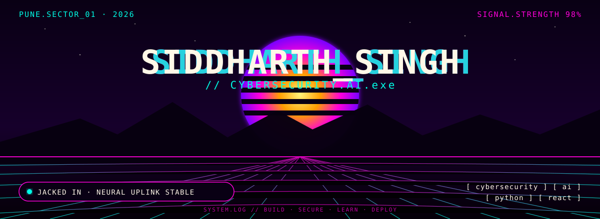

<p align="center">
  
</p>

### // whoami

i'm siddharth singh, a 4th-year computer engineering student focused on software development, cybersecurity, and artificial intelligence. i enjoy building practical systems and learning how intelligent software can be made more secure, reliable, and useful.

### // currently

- building and exploring projects at the intersection of **cybersecurity × ai**
- strengthening my skills in **python, web development, databases, and software engineering**
- learning more about **secure systems, ai-assisted security, and real-world application development**

### // completed

**Computer Lab Management System**

a full-stack web application for managing multiple computer labs, pcs, software records, and maintenance information.

`react` · `vite` · `django` · `mysql` · `python`

### // selected projects

| PROJECT | SIGNAL |
|---|---|
| [Computer Lab Management System](https://github.com/sidd-coder1/Lab-Management-System-LMS-) | full-stack lab & pc management |
| [LMS Frontend](https://github.com/sidd-coder1/LMS-Frontend) | web interface development |
| [Fullstack LMS](https://github.com/sidd-coder1/Fullstack-LMS) | frontend + backend integration |
| [SwachhDrishti](https://github.com/sidd-coder1/Hackathon) | civic technology / gps / ai concepts |
| [Fabric Wholesaler](https://github.com/sidd-coder1/fabric-wholesaler) | business website |

### // tech stack

```text
LANGUAGES       python · java · javascript · html · css
FRONTEND        react · vite
BACKEND         django
DATABASE        mysql · firebase
TOOLS           git · github · antigravity
FOCUS           cybersecurity · artificial intelligence

ACADEMIC.STATUS     4TH YEAR · BE COMPUTER ENGINEERING
CURRENT.MISSION     CYBERSECURITY × AI
PREVIOUS.MISSION    COMPUTER LAB MANAGEMENT SYSTEM
BUILD.MODE          FULL-STACK / SECURITY / AI
UPLINK              GITHUB

<p align="center"> <sub>// no noise. just code, security, intelligence, and continuous learning.</sub> </p>
